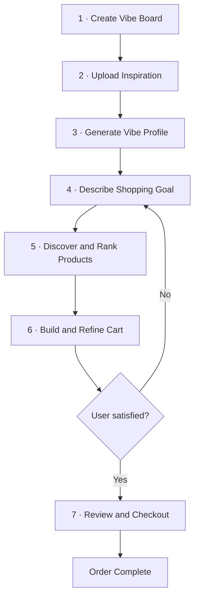
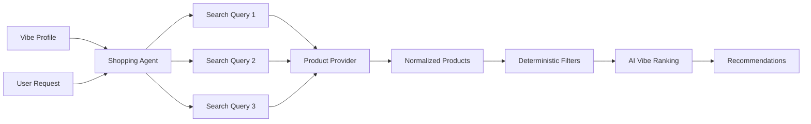
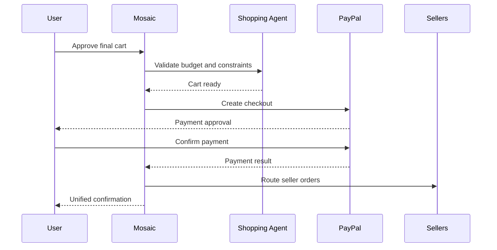
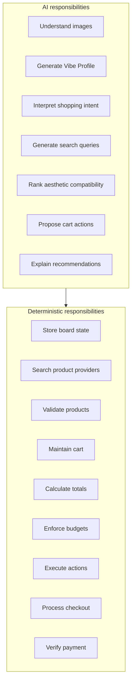
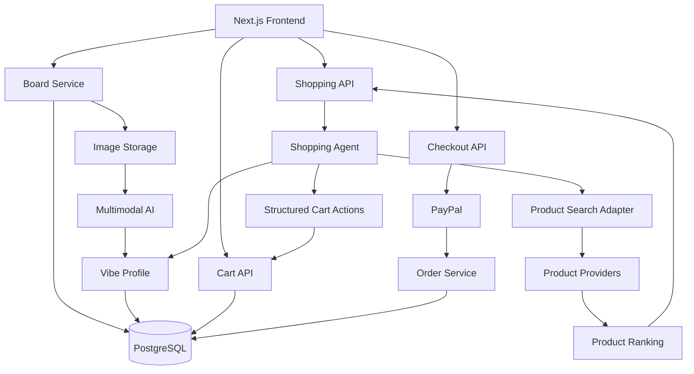

# Mosaic

### From inspiration board to checkout

Mosaic turns visual inspiration into a personalized AI shopping experience. Users build bulletin-board-style mood boards from photos they love, and Mosaic converts those images into a reusable representation of their aesthetic.

From there, users can shop conversationally across categories:

- “Find some things I could add to my room for under $300.”
- “Build me an outfit for a summer dinner.”
- “Find a desk lamp that matches this vibe.”
- “Keep the table, replace the rug, and make everything else cheaper.”

Mosaic combines multimodal AI, product discovery, an editable AI-managed cart, and streamlined payments to take users from **“I like this”** to **“I want to buy this”** without forcing them to translate their taste into search keywords or navigate multiple storefronts.

> The user provides the inspiration. Mosaic understands the aesthetic, finds the products, and builds the cart.

## Current implementation and verified progress

The repository contains a Next.js 16 frontend and API in [`apps/web/`](apps/web/README.md), a FastAPI vibe detection service in `apps/ml/`, and an applied Supabase schema in [`supabase/`](supabase/README.md). The bulletin-board UI uses the board, image, vibe-analysis, shopping-agent, cart, and sandbox checkout APIs. With an agent API key configured, the shopping conversation chooses demo-catalog products and adds them to the cart directly. Production retailer order routing and a single-confirmation multi-store payment flow remain planned.

**Completed on September 26, 2026:** One demo Mosaic cart was split into two merchant totals and paid through two distinct Stripe **sandbox** merchant accounts using Link. Store A's Ceramic Demo Lamp was **$1.00** and Store B's Terracotta Demo Vase was **$2.00**. Both Stripe Checkout Sessions finished with `payment_status: paid`; their PaymentIntents succeeded for the exact amounts, and both PaymentMethods had `type: link`. Stripe reported `livemode: false` throughout, so no real funds moved. The buyer made the final purchase decisions on Stripe's hosted pages without a Mosaic sign-in.

The [checkout verification record](docs/checkout-sandbox-verification.md) covers a real board/cart run through Next Route Handlers and Supabase: a $60.00 test cart split into $34.00 and $26.00 merchant orders, both paid and verified through distinct Stripe sandbox accounts. The checkout persisted across a Next restart, passed through a partial state, skipped the paid merchant on retry, and opened a fresh cart after completion. This proves the two-merchant **test payment flow**, not physical fulfillment or a production unified checkout. Each hosted Stripe page still requires a separate customer confirmation. The board now has review and payment controls; its new browser-only flow still needs a fresh end-to-end run. Setup and current limits are in the [Next API README](apps/web/README.md). Run `bun test` in `apps/web/` for the tests.

## Why Mosaic

Traditional online shopping starts with search.

That works when a shopper already knows exactly what they want:

> `cream linen shirt`

But people often begin with something much less structured:

> “I want my room to feel like these pictures.”

or:

> “I want clothes that match this aesthetic.”

Visual taste is difficult to communicate through keywords. A mood board might communicate color, texture, materials, shapes, atmosphere, and style simultaneously, but traditional ecommerce systems force the customer to manually translate those ideas into individual searches.

Mosaic treats the inspiration board itself as shopping context.

A board containing Mediterranean architecture, linen clothing, wood furniture, terracotta pottery, coastal landscapes, and neutral interiors might become:

**Sun-Washed Mediterranean**

- Cream, terracotta, olive, and warm brown
- Linen, natural wood, ceramic, and rattan
- Organic shapes
- Relaxed silhouettes
- Warm and minimal
- Subtle coastal influence

That profile is not tied to clothing, furniture, or any other individual category.

The same aesthetic can drive searches for:

- Clothing
- Furniture
- Room decor
- Accessories
- Lighting
- Gifts
- Travel products
- Anything else the user asks for

A board is not required to look like a mood board at all. A board containing mountains, trees, lakes, snow, and rocks might become:

**Wooded Alpine**

- Slate gray, moss green, and bark brown
- Wool, flannel, canvas, and raw wood
- Rugged textures
- Layered silhouettes
- Natural and gorpcore
- Outdoorsy influence

Nothing in the source photos is a product, and nothing in them is furniture or clothing. The profile still transfers the same way — the user can later ask for an outfit, a room, or a poster, and Mosaic applies **Wooded Alpine** to whichever category is requested.

## End-to-end system

```mermaid
flowchart LR
    subgraph Inspiration["Visual inspiration"]
        U[User] --> B[Vibe Board]
        B --> I[Uploaded Images]
    end

    subgraph Intelligence["AI preference layer"]
        I --> V[Multimodal Analysis]
        V --> VP[Vibe Profile]
        VP --> A[Shopping Agent]
        U -->|Natural-language request| A
    end

    subgraph Commerce["Commerce layer"]
        A --> Q[Product Search Queries]
        Q --> P[Merchant Products]
        P --> R[Vibe-Based Ranking]
        R --> C[Unified Cart]
    end

    subgraph Checkout["Checkout"]
        C --> O[AI Cart Optimization]
        O --> RV[User Review]
        RV --> PP[PayPal Checkout]
        PP --> S[Participating Sellers]
        S --> X[Order Confirmation]
    end
```



Mosaic deliberately separates responsibilities:

- The **multimodal model** understands visual taste.
- The **shopping agent** converts user intent into product requirements.
- The **product layer** retrieves real products.
- The **ranking layer** determines how closely those products match the user's board.
- The **cart engine** maintains deterministic cart and budget state.
- The **payment layer** handles the movement of money.
- The **user** always approves the final purchase.

## The shopping lifecycle

Mosaic operates as a seven-stage shopping loop.



### 1. Create

A user creates a board representing an aesthetic, event, room, trip, or other source of inspiration.

Examples:

- Summer in Italy
- Dream Apartment
- Work Fits
- Japan Trip
- Minimal Desk Setup

Each board acts as persistent visual context for future shopping sessions.

### 2. Inspire

Users upload images directly to a bulletin-board-style interface.

The images do not have to contain products.

A board can contain:

- Architecture
- Landscapes
- Clothing
- Interior design
- Art
- Materials
- Color palettes
- Furniture
- Photography
- Screenshots

Users can optionally annotate images to communicate what matters about them.

For example:

> “I like the colors and textures in this image, not the actual furniture.”

The images do not need to depict interiors, furniture, or fashion at all. A board of mountains, trees, lakes, snow, and rocks is a valid input — Mosaic should read that as an **outdoorsy / gorpcore / natural / wooded** vibe, not fail to produce a profile because nothing in the photos is a "product." The user decides afterward what category that vibe applies to (an outfit, a room, a poster, anything).

### 3. Understand

Mosaic sends the board to a multimodal model and requests a structured aesthetic representation.

Each facet returns a ranked list of descriptors, not a single forced label. A board rarely reduces to exactly one color, one material, or one mood — returning the top few candidates per facet keeps real ambiguity (a room that's plausibly both "warm" and "minimal") instead of discarding it.

Example:

```json
{
  "name": "Sun-Washed Mediterranean",
  "description": "A warm, relaxed Mediterranean aesthetic centered on natural materials and understated coastal influences.",
  "colors": [
    "cream",
    "terracotta",
    "olive",
    "warm brown"
  ],
  "materials": [
    "linen",
    "wood",
    "ceramic",
    "rattan"
  ],
  "styles": [
    "coastal",
    "minimalist"
  ],
  "shapes": [
    "rounded",
    "fluid"
  ],
  "qualities": [
    "warm",
    "natural",
    "minimal",
    "relaxed",
    "organic"
  ]
}
```

The resulting **Vibe Profile** is stored with the board.

Users can edit the generated profile if the model interprets something incorrectly.

The profile is intentionally product-category independent.

### 4. Ask

Users shop conversationally instead of constructing individual searches.

Examples:

> “Recommend some things I could add to my room for under $300.”

> “Find me clothes for a summer trip.”

> “Find a lamp under $100.”

> “Build me a desk setup but don't replace my monitor.”

The shopping agent combines:

- Vibe Profile
- Current request
- Budget
- Existing cart
- Locked products
- Previous conversation context

It then converts the request into structured shopping intent.

Example:

```json
{
  "intent": "room improvement",
  "budget": 300,
  "categories": [
    "lighting",
    "textiles",
    "wall decor",
    "small furniture",
    "decorative accessories"
  ]
}
```

## Category-independent shopping

Mosaic does not assume that a Vibe Profile represents a specific type of product.

Consider the following profile:

```text
Warm Mediterranean

Cream
Terracotta
Olive
Warm wood

Linen
Ceramic
Rattan

Natural
Relaxed
Minimal
Organic
```

A room request could generate searches for:

```text
warm ceramic bedside lamp
natural wood side table
cream textured throw
terracotta planter
minimal Mediterranean wall art
```

The same board could later receive:

> “Find me an outfit for a summer dinner.”

and generate:

```text
cream linen shirt
relaxed neutral trousers
brown leather loafers
minimal gold accessory
```

The board represents the **user's aesthetic**, not a product category.

## Product discovery

Mosaic translates shopping intent and the Vibe Profile into targeted search queries.



Product providers are hidden behind a common interface:

```text
searchProducts(
    query,
    category,
    maxPrice
)
```

This prevents the rest of Mosaic from depending on one retailer or product API.

A production deployment could connect:

- Individual merchants
- Marketplace catalogs
- Merchant feeds
- Shopping APIs
- PayPal-connected sellers

## Product ranking

Search results first pass through deterministic constraints such as:

- Maximum price
- Product category
- Availability
- Merchant eligibility

The remaining products are ranked against the user's Vibe Profile.

Mosaic can consider:

- Color compatibility
- Material compatibility
- Shape and silhouette
- Style
- User request
- Existing cart
- Budget
- Compatibility with already selected items

A recommendation might appear as:

```text
Ceramic Mushroom Lamp
$54

94% Vibe Match

Matches:
✓ Warm neutral palette
✓ Ceramic material
✓ Organic shape
✓ Minimal design
```

The model explains **why** a product was selected rather than presenting recommendations as unexplained AI output.

## The AI cart

Product recommendations become a real, structured cart rather than remaining inside the model's conversation history.

```json
{
  "budget": 300,
  "items": [
    {
      "productId": "lamp_123",
      "quantity": 1,
      "locked": true
    },
    {
      "productId": "rug_456",
      "quantity": 1,
      "locked": false
    }
  ]
}
```

Mosaic's application code—not the language model—calculates:

- Prices
- Quantities
- Cart totals
- Remaining budget
- Locked products

This keeps financial state deterministic.

## Conversational cart editing

Users can modify the cart directly through conversation.

> “I like the lamp and table. Keep those and replace everything else.”

> “Make this $50 cheaper.”

> “Find something more colorful for the wall.”

> “Keep everything under $250.”

> “Spend more on the chair and less on decorations.”

The model does not directly mutate cart state.

Instead, it produces structured proposed actions:

```json
{
  "actions": [
    {
      "type": "LOCK_ITEM",
      "productId": "lamp_123"
    },
    {
      "type": "REMOVE_ITEM",
      "productId": "rug_456"
    },
    {
      "type": "SEARCH",
      "query": "minimal Mediterranean wall art",
      "maxPrice": 60
    }
  ]
}
```

Mosaic validates and executes those actions through the cart engine.

Supported operations include:

```text
SEARCH
ADD
REMOVE
REPLACE
LOCK
UNLOCK
SET_BUDGET
```

This separation allows the AI to decide **what it wants to change** while deterministic application code decides **whether and how the change actually occurs**.

## Locking

Products can be locked by either clicking the lock control or using natural language.

For example:

> “Definitely keep this lamp.”

results in:

```text
LOCK_ITEM lamp_123
```

Future cart optimization leaves the item untouched.

This allows users and the AI to collaborate instead of the agent rebuilding the entire cart after every prompt.

## Budget-aware shopping

Mosaic continuously compares the real cart total against the user's stated budget.

```text
$238 / $300

████████████████░░░

$62 remaining
```

Before checkout, the agent can detect issues such as:

```text
Your cart is $17 over your $300 budget.

[Get under $300]    [Keep current cart]
```

Selecting **Get under $300** lets the agent search for replacements while respecting locked items.

The model determines what should change.

Application code verifies whether the resulting cart actually satisfies the constraint.

## Unified checkout (planned product flow)

Mosaic is designed around participating merchants rather than sending users through separate retailer checkout flows.

A cart might contain:

```text
Merchant A
    Ceramic Lamp             $54
    Side Table               $89

Merchant B
    Linen Shirt              $68

Merchant C
    Wall Print               $42

--------------------------------
Total                       $253
```

From the user's perspective, Mosaic maintains a single shopping experience:



For a production marketplace, participating merchants would be onboarded through the payment platform. The current Stripe Link sandbox prototype confirms two payments from one cart using two hosted merchant checkout pages; it does not yet provide the single confirmation flow illustrated above.

The hackathon implementation can demonstrate this architecture using sandbox sellers.

## Checkout philosophy

Mosaic removes friction **before** the user authorizes money movement.

The AI can:

- Discover products
- Compare alternatives
- Build the cart
- Optimize the budget
- Replace products
- Preserve locked items
- Explain recommendations

But the final transaction remains explicit.

```text
5 items

Shipping
Home ✓

Payment
PayPal ✓

Total
$283.14

[ Pay $283.14 ]
```

> AI handles the shopping. The customer authorizes the purchase.

## AI and deterministic boundaries

Mosaic intentionally separates generative tasks from financial and application state.



The model can suggest that a lamp should replace another lamp.

It cannot decide that the price charged was `$54`.

The product record determines the price.

The model can attempt to lower a cart below `$300`.

It cannot declare that the constraint was satisfied.

The cart engine calculates the result.

The model can prepare checkout.

It cannot authorize the user's payment.

## Vibe Boards as persistent preference

A Vibe Board is more than a one-time image upload.

It acts as reusable shopping context.

A user might maintain:

```text
Summer 2027
Dream Apartment
Work Style
Snowboarding
Japan Trip
Minimal Desk
```

A returning user can simply open an existing board and ask:

> “Find a lamp for this vibe.”

or:

> “Find some luggage for this vibe.”

without explaining the aesthetic again.

This turns visual inspiration into a portable preference representation that can travel across commerce categories.

## Example experience

A user uploads:

- Mediterranean bedroom
- Linen outfit
- Terracotta pottery
- Coastal photograph
- Wood furniture
- European architecture

Mosaic generates:

### Sun-Washed Mediterranean

```text
Cream · Terracotta · Olive · Brown

Linen · Wood · Ceramic · Rattan

Warm · Relaxed · Natural · Minimal
```

The user asks:

> Recommend some things I could add to my room for under $300.

Mosaic builds:

```text
Ceramic Bedside Lamp       $55
Natural Wood Side Table    $89
Cream Textured Throw       $42
Terracotta Planter         $34
Coastal Wall Print         $48

--------------------------------
Total                     $268
```

The user responds:

> I like the lamp and table. Keep those. Replace everything else and make it more minimal.

Mosaic locks the lamp and table, searches for alternatives, and updates the cart.

Then the user asks:

> Now find me an outfit for a summer dinner.

Without changing boards, Mosaic searches a completely different product category using the same underlying aesthetic.

That cross-category transfer is the core idea behind Mosaic.

## Architecture



## Technology

### Frontend

- Next.js
- React
- TypeScript
- Tailwind CSS
- shadcn/ui

### Data

- PostgreSQL
- Supabase
- Supabase Storage

### AI

- Multimodal vision-language model
- Structured-output generation
- Tool/action-based shopping agent

### Commerce

- Normalized product-search layer
- Multi-merchant catalog
- Structured cart service
- Budget engine

### Payments

- Stripe Link sandbox checkout in Next Route Handlers (local CLI path; prior standalone run verified)
- Frontend checkout integration and production seller onboarding (planned)
- The PayPal flow shown in the product diagrams is a design proposal, not implemented code

### Deployment

- Vercel

## Core data model

```text
User
 └── Board
      ├── BoardImage
      ├── VibeProfile
      └── Cart
           └── CartItem
                └── Product

User
 └── Order
      └── OrderItem
```

### Board

```text
id
user_id
name
created_at
updated_at
```

### BoardImage

```text
id
board_id
image_url
note
created_at
```

### VibeProfile

```text
id
board_id
name
description
profile_json
updated_at
```

### Product

```text
id
merchant_id
name
description
category
price
image_url
product_url
metadata
```

### Cart

```text
id
user_id
board_id
budget
status
```

### CartItem

```text
id
cart_id
product_id
quantity
locked
```

## Project structure

```text
app/
├── boards/
│   ├── page.tsx
│   └── [boardId]/
│       ├── page.tsx
│       └── shop/
│           └── page.tsx
│
├── checkout/
│   └── page.tsx
│
├── order/
│   └── [orderId]/
│       └── page.tsx
│
└── api/
    ├── boards/
    ├── analyze/
    ├── shop/
    ├── products/
    ├── cart/
    └── checkout/

components/
├── boards/
│   ├── BoardCard.tsx
│   ├── BulletinBoard.tsx
│   ├── BoardImage.tsx
│   └── ImageUploader.tsx
│
├── vibe/
│   └── VibeProfile.tsx
│
├── shopping/
│   ├── ShoppingWorkspace.tsx
│   ├── ChatPanel.tsx
│   ├── ProductCard.tsx
│   └── ProductGrid.tsx
│
└── cart/
    ├── CartPanel.tsx
    ├── CartItem.tsx
    └── BudgetBar.tsx

lib/
├── ai/
│   ├── analyzeBoard.ts
│   ├── understandRequest.ts
│   ├── generateSearchQueries.ts
│   ├── rankProducts.ts
│   └── shoppingAgent.ts
│
├── products/
│   └── searchProducts.ts
│
├── cart/
│   └── cartService.ts
│
├── payments/
│   └── paypal.ts
│
└── database/
    └── supabase.ts
```

## Three-person team

### Frontend + Board Experience

Owns:

- Vibe-board interface
- Image upload experience
- Vibe Profile visualization
- Shopping workspace
- Product cards
- Cart UI
- Checkout UI

### AI + Agent

Owns:

- Multimodal board analysis
- Vibe extraction
- Shopping-intent parsing
- Search-query generation
- Product ranking
- Recommendation explanations
- Conversational cart actions

### Backend + Commerce

Owns:

- Database
- Image storage
- Product-search integration
- Product normalization
- Cart state
- Budget calculations
- Agent-action execution
- PayPal checkout
- Order state

## Development milestones

### Milestone 1 — Understand the board

```text
Upload images
      ↓
Analyze collage
      ↓
Generate Vibe Profile
      ↓
Display profile
```

### Milestone 2 — Shop the vibe

```text
User request
      ↓
Shopping intent
      ↓
Product searches
      ↓
Vibe ranking
      ↓
Recommendations
```

### Milestone 3 — Collaborative cart

```text
Recommendations
      ↓
AI builds cart
      ↓
User gives natural-language edits
      ↓
Structured cart actions
      ↓
Updated cart
```

### Milestone 4 — Commerce

```text
Final cart
      ↓
Budget verification
      ↓
User review
      ↓
Stripe Link sandbox checkout prototype (implemented); integrated production checkout remains planned
      ↓
Order confirmation
```

## Design principle

Mosaic is not a chatbot wrapped around product search.

The system turns:

```text
Unstructured visual inspiration
            ↓
Structured aesthetic representation
            ↓
Shopping intent
            ↓
Product retrieval
            ↓
Aesthetic ranking
            ↓
Collaborative cart
            ↓
Secure checkout
```

into one continuous shopping experience.

> **Shop what you mean, not what you can describe.**
